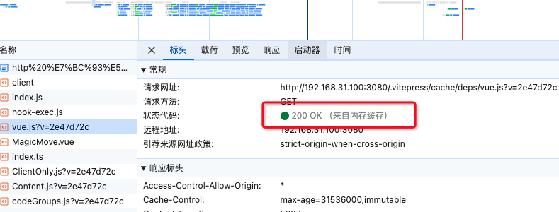
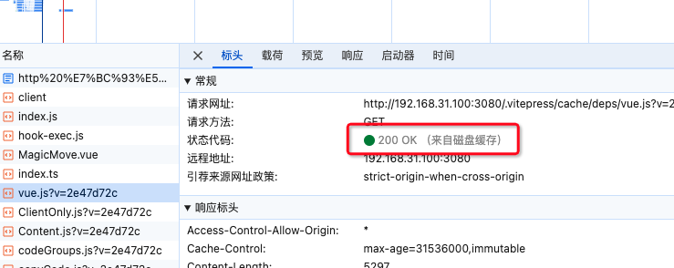
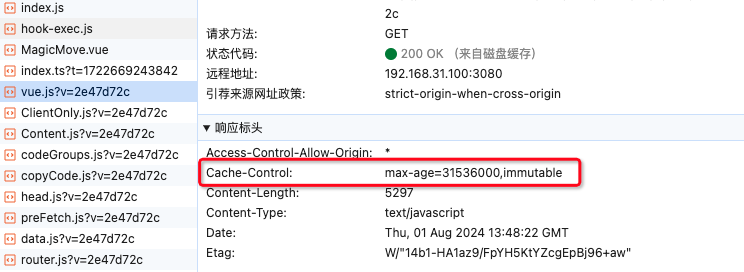
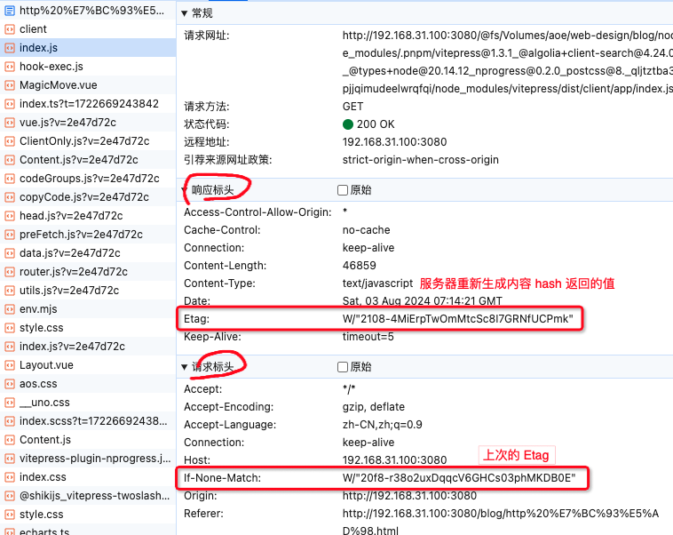
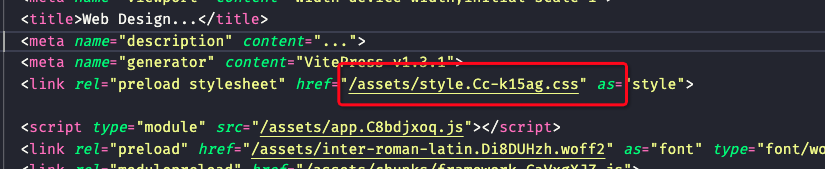

# HTTP 缓存

::: tip
HTTP 缓存是 Web 缓存技术的一种，是指浏览器或代理服务器**为了减少服务器负载和加快页面加载速度**，如果服务器和用户的浏览器离得比较远，那下载过程会比较耗时，网页打开也就比较慢。而对之前获取过的资源副本进行存储，当用户再次访问该资源时，直接从缓存中读取资源，而不是重新向服务器发起请求。这样重复利用缓存资源，**可以节省带宽消耗**，提高网站性能，这在一两个用户的网站访问中可能体现不出来，但是在大量用户高并发访问的情况下，就会体现出明显的优势。

判断一个网站的性能优劣，最直观的方法是查看网站的加载速度，而 HTTP 缓存是提升网站性能的重要手段之一。
:::

## Memory Cache 和 Disk Cache

按**资源缓存**的可以分为两类：

-   内存缓存( Memory Cache )
-   磁盘缓存( Disk Cache )

当是首次访问资源，资源会被缓存内存中，同时也会在磁盘中缓存一份(保留一份副本)。**让用户是刷新页面的时候，如何缓存没有过期，会优先从内存中读取资源。**例如：


当用户**关闭页面之后，当前页面内存中的缓存资源会被清除**，而磁盘中的缓存资源会被保留，当用户再次访问该网站资源时，就可以从磁盘中读取资源**并再次缓存到内存中**。例如：


## 缓存策略

缓存策略是理解 HTTP 缓存很重要的一环。说到底**缓存策略的核心无非就是解决什么时候使用缓存，什么时候更新缓存。**

按**缓存策略**的不同，可以分为以下几种：

-   强缓存(**Expires、Cache-Control**)
    <!-- -   Expires 是 HTTP1.0 的产物，表示资源的到期时间，是一个绝对时间，即到了这个时间，资源就会过期，需要重新请求资源。
    -   Cache-Control 是 HTTP1.1 的产物，是一个相对时间，表示资源的有效时间，单位是秒，例如：`Cache-Control: max-age=31536000`，表示资源有效时间是一年。 -->
-   协商缓存(**Last-Modified、ETag**)

### 强缓存

Expires 和 Cache-Control 是控制强缓存的两个字段，**强缓存表示当缓存资源没有过期时，直接从缓存中读取资源，“不需要向服务器发起请求”。**

Expires 是 **HTTP1.0** 的产物，表示资源的到期时间，是一个绝对时间，即到了这个时间，资源就会过期，需要重新请求资源。

::: warning 注意
Expires 是一个绝对时间，如果服务器的时间和客户端的时间不一致，可能会导致缓存失效。它是以服务器时间为准的，如果服务器时间和客户端时间相差很大，可能会导致缓存失效。
:::

Cache-Control 是 **HTTP1.1** 的产物，是一个相对时间，**表示资源的有效时间**，单位是秒，例如：`Cache-Control: max-age=31536000`，表示资源有效时间是一年。
可以看到这个是一个 `vite` 开发环境打包的 `vue.js` 依赖使用了 `Cache-Control` 字段，表示资源有效时间是 31536000 秒，即一年。


-   `max-age`：表示资源的有效时间，单位是秒。
-   `no-cache`：允许缓存，但每次都要协商
-   `no-store`：表示不使用任何缓存策略，每次请求都会向服务器发起请求。
-   `public`：表示资源可以被任何中间缓存代理服务器缓，例如允许代理服务器缓存资源。
-   `private`：表示资源只能被客户端缓存，中间缓存代理服务器不能缓存。
-   `s-maxage`：代理服务器的资源过期时间
-   `immutable`：就算过期也不用协商，资源就是不变的
-   `max-stale`：过期一段时间的话，资源也能用
-   `stale-while-revalidate`：在验证（协商）期间，返回过期的资源
-   `stale-if-error`：验证（协商）出错的话，返回过期的资源
-   `must-revalidate`：不允许过期了还用过期资源，必须等协商结束

Cache-Control 的值可以使用 `,` 分隔多个值，例如：`Cache-Control: max-age=31536000, immutable`，表示资源有效时间是一年，并且资源是不可变的(文件确定不会再变，不需要协商)。

::: tip Expires 和 Cache-Control 的比较
优先级：`Cache-Control` 的优先级高于 `Expires`，如果同时存在 `Cache-Control` 和 `Expires`，`Cache-Control` 会覆盖 `Expires`。
精确度：`Cache-Control` 的时间是相对时间，不受服务器时间影响，更加精确。
在 HTTP1.1 中，`Cache-Control` 是推荐使用的缓存策略。
:::

---

### 协商缓存

协商缓存是指**浏览器携带上次请求资源时返回的缓存标识**，向服务器发起请求，由服务器根据缓存标识决定是否使用缓存的策略。如果缓存有效，服务器会返回 **304** 状态码，告诉浏览器直接从缓存中读取资源。

#### `ETag` 和 `If-None-Match`

`ETag` 是服务器为每个资源生成的一个唯一标识符。它通常是基于资源的**内容生成的哈希值**或者其他唯一标识符，**目的是表示资源的版本**。如果资源内容发生变化，服务器会生成一个新的 `ETag` 值。

`If-None-Match` 表示资源的 `ETag` 值，如果资源的 `ETag` 值和服务器的 `ETag` 值一致，表示资源没有发生变化，可以直接从缓存中读取资源。

::: tip
`If-None-Match` 是 HTTP 协议中的一个**请求头字段**，它通常和 `ETag` 一起使用，用于缓存控制和条件请求。`If-None-Match` 请求头用于告诉服务器仅当请求的资源在服务器上的 `ETag` 不匹配时才返回资源。否则，服务器会返回 `304 Not Modified` 状态码，表示资源未修改，客户端可以继续使用缓存的版本。

`If-None-Match` 的值是上次请求资源时服务器返回的 `ETag` 值。
:::



工作流程
1、首次请求：客户端请求资源，服务器返回资源内容以及 ETag。
2、缓存检查：客户端缓存该资源，并存储对应的 ETag。
3、再次请求：客户端再次请求相同资源时，会在请求头中带上 `If-None-Match: <ETag>`。
服务器检查：

-   如果资源未改变，ETag 匹配，服务器返回 304 Not Modified，客户端使用缓存内容。
-   如果资源已改变，ETag 不匹配，服务器返回新的资源内容和新的 ETag。

#### `Last-Modified` 和 `If-Modified-Since`

`Last-Modified` 是资源的最后修改时间，服务器会在响应头中返回 `Last-Modified` 字段，表示资源的最后修改时间。
`If-Modified-Since` 是请求头字段，表示资源的最后修改时间，客户端会在请求头中带上 `If-Modified-Since: <Last-Modified>`。

类似于 `ETag` 和 `If-None-Match` 的功能，但基于资源的修改时间而非标识符。它的作用是告诉服务器，只有在资源自这个时间以来被修改过的情况下，才返回新的资源内容。否则，服务器返回 `304 Not Modified` 状态码，表示资源未修改，客户端可以继续使用缓存的版本。

带上 `etag` 请求的 header 为 `If-None-Match`:

```yaml
If-None-Match: 'xxx'
```

带上 `last-modified` 时间请求的为 `If-Modified-Since`：

```yaml
Last-Modified: Wed, 21 Oct 2015 07:28:00 GMT
```

工作流程也是类似的，只是 `Last-Modified` 是基于资源的修改时间，而 `ETag` 是基于资源的标识符。

::: tip ETag 和 Last-Modified 的比较
精确性：`ETag` 更加精确，因为它基于资源内容的变化，而 `Last-Modified` 基于时间，不够精确。
使用场景：有些场景中，`ETag` 更适合，比如**资源的修改频繁**且内容变更复杂时；而在简单情况下（比如**内容变更不频繁或时间精度够用时**），Last-Modified 也能很好地满足需求。
:::

::: tip HTTP 1.0 和 HTTP 1.1

为了更好的利用缓存，HTTP1.1 引入了更多的缓存控制策略，比如 **`Cache-Control`，`ETag`** 等，相比于 HTTP1.0，HTTP1.1 的缓存策略更加灵活，更加精确。
当然，我们是可以同时使用 HTTP1.0 和 HTTP1.1 的缓存策略的。在混合使用 HTTP1.0 和 HTTP1.1 缓存策略时，Cache-Control 具有更高的优先级，且 ETag 通常优先于 Last-Modified。HTTP1.1 的缓存策略优先级通常高于 HTTP1.0。且**强缓存优先于协商缓存**，在强缓存有效期内，不会向服务器发起请求。
:::

---

强缓存适用于**不经常变化的资源且资源巨大**的文件，而协商缓存适用于**经常变化的资源**。在实际开发中，我们可以根据资源的特点，选择合适的缓存策略。

当然为了更好的利用缓存，提高灵活性。我们可以为资源文件设置**版本号**或者**哈希值**，这样当资源文件发生变化时，版本号或者哈希值也会发生变化，从而强制浏览器重新请求资源文件。


::: tip
通常会在网站的 `index.html` 文件设置为**不缓存**或`协商缓存`，而其他资源文件设置为**强缓存**，这样可以保证网站的内容更新及时，同时又能充分利用缓存，提高网站性能。
:::

### 浏览器缓存操作

用户在浏览器中不同的操作，会对缓存产生不同的影响，具体也和不同的浏览器引擎相关。

-   **正常刷新**：浏览器会向服务器发送请求，服务器会根据缓存策略返回资源(跳过强缓存，但会**发送协商缓存请求**)。
-   **强制刷新**：浏览器会忽略缓存，向服务器发送请求，**跳过强缓存和协商缓存**，直接从服务器获取资源。
-   **Ctrl + F5**：强制刷新，浏览器会忽略缓存，向服务器发送请求，**跳过强缓存和协商缓存**，直接从服务器获取资源。
-   **F5**：正常刷新，浏览器会向服务器发送请求，服务器会根据缓存策略返回资源(跳过强缓存，但会**发送协商缓存请求**)。

| 浏览器操作 | 强缓存(Expires/Cache-Control) | 协商缓存(Last-Modified/ETag) |
| ---------- | ----------------------------- | ---------------------------- |
| 地址栏回车 | 有效                          | 有效                         |
| 页面跳转   | 有效                          | 有效                         |
| 正常刷新   | 无效                          | 有效                         |
| 强制刷新   | 无效                          | 无效                         |

::: danger 注意
当设置了 `Cache-Control: no-cache` or `Cache-Control: max-age=0` 时，浏览器会**跳过强缓存**，但是如果存在协商标识策略**会发送协商缓存请求**，即**不使用强缓存，但是使用协商缓存**。

例如 `Cache-Control: max-age=600` 表示资源有效时间是 10 分钟，假如在 10 分钟后过期了，只是到了过期时间，但是资源并不一定有变化，它也不一定会重新请求下载资源，
而是要和服务端确认内容是否真的修改了，修改了就重新下载，否则不用再下载，这样一个协商的过程。
:::
