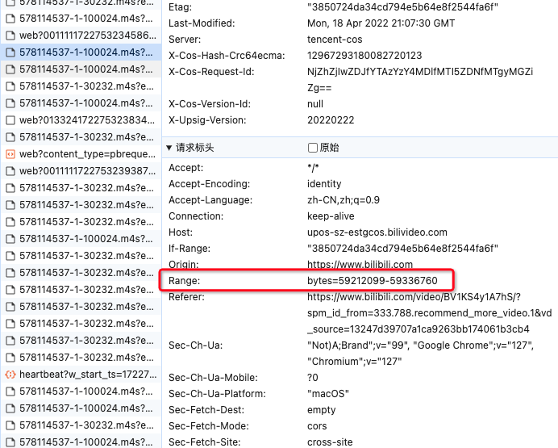

# 认识 HTTP

从历史角度探究 HTTP 协议的发展。HTTP 于 **1989 年诞生，1996 年 HTTP1.0 正式成为标准，1999 年 HTTP1.1 成为标准，2015 年 HTTP2.0 成为标准。**
HTTP 与 JavaScript 一样，新的特性不断被添加，但是同样都是需要不同的浏览器或服务器支持的，并且表现可能不一样。

::: warning HTTP2.0
虽然 HTTP2.0 在 2015 已经成为标准，但是并不是所有的浏览器都支持 HTTP2.0，所以在实际开发中，还是需要考虑兼容性问题。而且许多网站目前还是使用 HTTP1.1。

**HTTP1.1 版本是一个划时代的标准**，它的出现使得 HTTP 协议更加高效，更加灵活，更加安全。HTTP1.1 的出现，使得 HTTP 协议的性能有了很大的提升，但是 HTTP1.1 也有一些缺点，例如：**队头阻塞、无状态、明文传输等**。
:::

比如所在 HTTP1.0 中：

-   TCP 连接是无法复用的，意味着每次请求都需要建立一个新的 TCP 连接，重复三次握手和四次挥手的过程。
-   每个请求都是一个独立的请求，无法复用，导致队头阻塞。

**队头阻塞**：好像就是每个请求都是在过一个“独木桥”，桥的宽度为请求的宽度，如果请求的宽度很大，那么后面的请求就会被阻塞，直到前面的请求完成。

## HTTP1.1

1、Connection: keep-alive
添加(`Connection: keep-alive`)持久连接，即**TCP 连接是可以复用的**，一个 TCP 连接可以传送多个请求，这样就避免了每次请求都需要建立一个新的 TCP 连接，重复三次握手和四次挥手的过程，减少了连接建立和断开的开销，显著提高了传输效率。这个特性默认是开启的，所以我们在开发中不需要关心这个问题。

但，如果在连接建立后，如果一段时间内没有发出 HTTP 请求后，这个持久长连接就会断开，具体的超时时间也可以在 header 中进行设置。

2、管线化
因为 `Connection: keep-alive` 的存在，所以可以**同时传送多个请求(并发多个请求)**，浏览器同时传送多个请求，无需等待是一个请求的返回结果即可处理其他请求，虽然这样看上去确实是解决了“队头阻塞”的问题，但是实际上从本质上来说，并没有完全解决“队头阻塞”的问题，**只有处理完第一个请求的响应结果返回后，才能处理第二个请求的响应结果(下次请求要等上一个请求返回响应才能发出)**。对请求的响应仍然是先进先出的。🫨
所以说，**管线化只是可以使浏览器可以并行发送多个请求，但是对于响应结果的处理仍然是串行的。**比较鸡肋，大部分浏览器厂商都没有实现这个特性或者关闭这个特性。

要解决“队头阻塞”的问题，我们可以使用“域名分片”或者“CDN”技术来解决，这样可以**增加并发请求数量**，提高并发请求的效率。
浏览器通常会限制每个域名的并发连接数，通常是 6-8 个，所以我们可以使用多个域名来请求资源，比如把静态资源部署在不同的域名下。

3、缓存控制

-   强缓存：添加 `Cache-Control`，更加精确。
-   协商缓存：`ETag` 和 `If-None-Match`，使用资源的标识符来判断资源是否发生变化，更加精确。

并且 `Cache-Control` 使用的格式更加灵活，可以设置多个参数，比如 `max-age`、`no-cache`、`no-store` 等。使用的编码格式更加灵活，可以使用 `,` 分隔多个值，例如：`Cache-Control: max-age=31536000, immutable`，表示资源有效时间是一年，并且资源是不可变的。这是 HTTP1.1 为了改善缓存控制而添加的特性，把多个缓存相关的字段合并到一个字段中。
这种方式称为`指令`(directive)，而像 `Expires` 这种方式 `key-value` 的方式叫做 `消息头`。

4、宽带优化，添加 `range` 字段，可以实现**断点续传**。

用户在下载大文件时，如果网络中断或用户手动暂停下载，可以通过 Range 头域请求从中断的地方继续下载剩余的部分。或者，在视频或音频流媒体播放中，客户端通常不会一次性加载整个文件，而是根据需要动态加载文件的部分内容。这样可以节省带宽，提高用户体验。例如 bilibili 视频的加载就是这样的，先加载一部分，然后再加载后面的部分：

5、错误类型更加丰富，添加了更多的状态码。

6、`Host` 字段，可以指定服务器的域名。如果消息中没有 `Host` 字段，则会报错。

::: tip
基于 HTTP1.1 的特性，一些前后端交互的方案也应运而生：

-   `websocket`：全双工通信，实时性更强。
-   `HTTP-Long-Polling`：长轮询，实时性较强。
-   `HTTP-streaming`：流式传输，实时性较强。

:::

::: danger HTTP1.1 的缺点

-   没有从根本上解决“队头阻塞”问题。
-   header 请求头信息过大，占用带宽。
-   明文传输，不安全。
-   默认开启 `Connection: keep-alive`，可能导致服务器资源耗尽。
-   有限的并发请求，虽然 HTTP1.1 支持持久连接，但浏览器通常会限制每个域名的并发连接数，通常是 6-8 个。
-   复杂的缓存管理，虽然提供更高精度的缓存控制，但是缓存管理复杂。
    :::

header 中的 `key-value` 都是使用文本进行描述的，文本需要经过编码占据很大的字节，例如：`Content-Type: text/html`，这样的话增加了传输的开销。
所以要尽量**避免一些小请求**，小请求也是会带上很多 header 请求信息。比如 `cookie、Authorization` 等，这些信息都会占用很大的字节。
同时在打包前端代码的时候，可以对一些小的 chunk 进行合并，一些图片资源可以使用 base64 编码或者使用雪碧图等方式减少请求数量。

## HTTP2.0

HTTP2.0 的出现，大部分都是对 HTTP1.1 的缺点进行优化的重大升级，没有添加新的特性，即使从 HTTP1.1 到 HTTP2.0，相隔了 16 年。它的目标是显著提升性能，同时做到迁移成本最小化。

以下是 HTTP2.0 的一些概念：

-   帧：客户端与服务器之间的通信是通过帧进行的，帧是最小的数据传输单位。
-   消息：消息是由一个或多个帧组成的，消息是逻辑上的概念。
-   流：流是消息的基本单位，每个流都有一个唯一的标识符，用于区分不同的流。

HTTP2.0 的特性：

**1、二进制分帧，协议解析采用二进制格式，而非前面的版本那样采用文本格式**，文本传输太占空间，换成二进制。

2、在二进制分帧传输中，有一个标识，会为每一帧分配一个流标识符。每个请求响应加上一个 标识 ID，通过标识 ID 来找到它对应的请求响应，解决了“队头阻塞”问题。这是真正意义上的“多路复用”。

3、header 报头压缩，使用 HPACK 算法对头部信息进行压缩。

4、允许客户端为请求指定优先级，这样服务器可以优先处理高优先级的资源，优化了页面加载的顺序和速度。

5、引入了**服务器主动推送（Server Push）**功能，允许服务器在客户端请求某个资源时，主动推送相关资源（如 CSS、JS 文件）到客户端，从而减少了往返延迟。

6、安全性的支持等
